# Crypto Launch Intelligence

Data-source implementation, configuration, and live-health truth are audited
separately. See [Data Source Readiness](docs/DATA-SOURCE-READINESS.md) and run
`npm run sources:readiness`; missing live evidence remains a production blocker.

[](https://nodejs.org/)
[](LICENSE)
[](https://bilyeutaylor9-lang.github.io/Crypto-Launch-Intelligence/)
[](#engine-stack)
[](#ai-command-system)

## Autonomous AI Crypto Research Operating System

Crypto Launch Intelligence is an AI-powered crypto research desk built to discover early-stage market opportunities before they become obvious.

The scanner searches the complete legitimate market and never confuses "easy for me to buy" with "best opportunity." Coinbase, MetaMask, preferred wallets, preferred exchanges, and geographic availability belong in a separate accessibility layer, not the core project-quality ranking.

It scans free market, launch, social, GitHub, roadmap, liquidity, narrative, catalyst, wallet, and web research sources, then routes every project through a multi-agent intelligence pipeline.

This is not a simple token screener. It is a layered research system with:

- Free-source project discovery
- 39,000-candidate wide scan mode
- Discovery Truth Network with canonical source manifest, lifecycle lanes, evidence-family independence, and rejected-candidate shadow watchlist
- Native Discovery Mesh for early pool lifecycle events, first real buyers, usable liquidity, and deployer reputation checks
- Discovery Decision Engine with project identity graph, organic demand firewall, instant safety gate, lifecycle-adjusted ranking, and missed-winner lab
- Evidence-Calibrated Parallel Intelligence Kernel with engine contracts, evidence ledgers, calibrated scores, and final decision overrides
- Institutional Data Provenance Ledger for source, timestamp, confidence, observation type, source agreement, and promotion readiness
- Progressive Opportunity Ranking that separates early-movement opportunity from trust, safety, execution, and missing-proof checks
- Explosion Readiness ranking that requires liquidity, independent buyers, volume, builder/catalyst, attention-gap, and multi-scan persistence evidence before labeling a project as coiled or accelerating
- Execution Proof Engine with route evidence, provider-outage handling, money confidence, and fresh quote/slippage/liquidity checks
- Canonical Identity Resolver that protects against ticker collisions and only hard-blocks true contract conflicts
- Four-lane candidate reporting: `SNIPER_READY`, `BEST_AVAILABLE`, `EMERGING_RESEARCH`, and `HARD_BLOCKED`
- AI research agents
- Causal signal reasoning
- Autonomous Alpha Knowledge Graph
- Causal Market Twin scenario engine
- Small-Cap Hunter for two best-available $100 paper-research candidates with route accessibility separated from project-quality scoring
- Proof-of-Alpha Execution Twin for route-verified $100 paper execution simulations
- Organic Demand Integrity layer for holder, activity, liquidity, admin-control, yield, and valuation-truth risk
- Organic proof queue that assigns wallet-flow, supply-truth, liquidity-exit, contract-safety, and evidence-auditor tasks before promotion
- Self-evolving Alpha OS with thesis generation
- Paper-trade strategy simulation
- Outcome learning
- Watchtower alerts
- GitHub Pages dashboard publishing
- Persistent local memory
- Machine-readable institutional reports

> Research software only. This project does not provide financial advice, trading advice, or guaranteed predictions. Every output should be manually verified before any real-world decision.

## Forward Edge Truth

The system does not infer edge from feature count or backtests. It freezes exact treatment candidates and same-chain matched controls before outcomes, collects exact future observations, grades net performance with clustered uncertainty, and evaluates the latest strategy fingerprint rather than selecting the best historical result. Predeclared sample checkpoints and alpha spending control repeated strategy search and optional stopping.

```bash
npm run production:shadow
npm run outcomes:probe
npm run production:grade
npm run edge:verify
```

`edge:verify` is expected to exit non-zero until real forward sample, outcome-capture, execution-cost, match-quality, time-replication, return, hit-rate, and catastrophic-loss gates pass. Post-outcome control matching is diagnostic-only and cannot issue a certificate. See [`docs/FORWARD-EDGE-AUDIT.md`](docs/FORWARD-EDGE-AUDIT.md) for the full operating contract.

## CLI 15.0 — Forward Alpha Validation OS

CLI 15 turns the CLI 1–14 research stack into a fail-closed forward-proof system. Every new prospective treatment is bound to an immutable prediction contract containing exact chain/token/pool identity, decision and source timestamps, price, predeclared horizons, probabilities, scores, feature snapshot hash, thesis evidence, code/model/config versions, and execution-cost provenance. Later observations cannot rewrite the contract.

The validator matures exact outcomes at 1 hour, 6 hours, 24 hours, 7 days, and 30 days; subtracts frozen execution costs; measures precision-at-K, calibration, drawdown, capture, and regime/narrative/chain performance; and compares the strategy with controls frozen before outcomes. It then emits one verdict: `PROVEN`, `UNPROVEN`, or `DEGRADED`.

```bash
npm run production:shadow
npm run outcomes:probe
npm run cli15:validate
npm run cli15:report
```

CLI 15 never authorizes automatic trading or automatic model promotion. A verified result can only become eligible for human review. Integrity damage, forward deterioration, or canary failure triggers a shadow-selection kill switch and rollback to the last verified champion. See [`docs/CLI-15-FORWARD-ALPHA-VALIDATION.md`](docs/CLI-15-FORWARD-ALPHA-VALIDATION.md).

## Quick Start

Run the full no-key demo:

```bash
npm install
npm run demo
open reports/report.html
```

Run a normal scan:

```bash
npm run scan
```

Run the wide free-source scan:

```bash
npm run scan:wide
```

Run the explicit 39,000-project scan:

```bash
npm run scan:39000
```

Run the institutional 39,000 -> 4,000 standard funnel:

```bash
npm run scan:4000
```

Run the maximum Alpha OS scan:

```bash
npm run scan:op
```

Inspect the evidence-backed pre-breakout readiness report after a scan:

```bash
npm run explosion-readiness
```

Run a smaller 100-candidate health scan before a big run:

```bash
npm run scan:debug100
```

Publish the local dashboard:

```bash
npm run publish:dashboard
open docs/index.html
```

Inspect the newest AI operating verdicts:

```bash
npm run ai-command-center
npm run strategy-lab
npm run causal-brain
npm run alpha-os
npm run alpha:os
npm run alpha:thesis
npm run alpha:contracts
npm run alpha:judge
npm run alpha:receipts
npm run alpha:graph
npm run causal:twin
npm run alpha:governor
npm run small-caps
npm run execution-twin
npm run organic-integrity
npm run provenance
npm run alpha:opportunities
npm run discovery-truth
npm run native-mesh
npm run native-report
npm run decision-engine
npm run debug:stage-health
npm run debug:ladder
```

## What Makes It Different

Most scanners answer:

> What is pumping right now?

Crypto Launch Intelligence is designed to answer:

> What is quietly improving before the market fully notices?

The system does not trust one score. It builds a full research case:

- Discovery breadth: finds projects from many free sources instead of one API.
- Discovery truth: separates active live sources from planned sources and ranks prelaunch, new-pool, and established-emerging projects differently.
- Native discovery: normalizes pool lifecycle events across EVM factories and Solana programs into one launch timeline.
- Decision firewall: verifies identity, buyer quality, safety, lifecycle stage, and risk caps before ranking an early pool.
- Signal fusion: combines market, liquidity, narrative, catalyst, GitHub, social, roadmap, and risk data.
- Organic demand checks: discounts raw holders, tx counts, repeated-wallet activity, circular volume, displayed liquidity, extreme yield, and source-disagreement traps.
- Proof queue: turns weak activity, supply, liquidity, admin, yield, and source evidence into open research tasks before the scanner can promote a candidate.
- Agent debate: multiple AI-style specialist agents argue the bull case, bear case, proof gaps, and invalidation rules.
- Causal reasoning: identifies which signal is actually driving the opportunity.
- Knowledge graph memory: links projects, chains, narratives, sources, GitHub, catalysts, peer clusters, and past scans.
- Causal market twin: runs scenario paths for bull, base, bear, listing surprise, liquidity drain, narrative rotation, and invalidation.
- Paper simulation: tracks strategy ideas before treating them as trusted.
- Outcome memory: compares old calls against later market behavior.
- Dashboard publishing: turns every scan into a public GitHub Pages intelligence dashboard.
- Self-auditing kernel: checks engine contracts, evidence coverage, source independence, identity confidence, safety gates, and final-decision provenance.
- Institutional provenance: requires source lineage, freshness, direct observation, and cross-source agreement before a project can receive institutional-ready data status.
- Progressive opportunity ranking: always shows the strongest non-hard-blocked best-available leads while preserving strict final safety gates.
- Execution proof: never treats a provider outage as proof that no route exists, and never claims route proof unless execution evidence exists.
- Identity protection: joins candidates through exact contract, pool, venue-asset, market, or external-ID anchors; conflicting exact identities cannot collapse into one project.
- Research/market separation: repository and news discoveries remain research entities until an exact tradable identity and concrete market evidence are attached.
- Utility-first guardrail: obvious meme branding is excluded from intelligence, recovery, dashboard, and public alert lanes by default; internal forensic risk history can still be retained.

### Institutional integrity defaults

- Missing price, liquidity, volume, contract, pool, and route evidence remains `null` or explicitly unavailable. Missing data is never converted into a favorable zero.
- CoinGecko catalogue identity is preserved when it is enriched with market rows, including platform contracts returned by the free coin-list endpoint.
- EVM execution recovery requests actual same-chain buy and sell quotes from LI.FI using the exact contract. Solana recovery uses Jupiter, while 0x remains an optional keyed fallback.
- A ticker-derived CEX market such as `SYMBOLUSDT` is never invented. CEX depth can be probed only when discovery supplied an explicit venue and market identity.
- Research-only entities and aggregate market rows cannot enter route recovery or execution-ready rankings.
- The scanner never sends a transaction. Route recovery is quote-only research, and every execution claim must retain its provider evidence and timestamp.

## System Architecture

```mermaid
flowchart LR
  A["Free Data Sources"] --> B["Discovery Manager"]
  A2["Native Pool Events"] --> B
  B --> C["Discovery Truth + Identity Graph"]
  C --> D["Candidate Rescue + AI Discovery Swarm"]
  D --> D2["Discovery Decision Engine"]
  D2 --> E["Core Intelligence Pipeline"]
  E --> F["Proof + Organic Demand + Risk Engines"]
  F --> G["AI Council + Research OS"]
  G --> H["Strategy Lab + Causal Alpha Brain"]
  H --> I["Knowledge Graph + Causal Market Twin"]
  I --> K["Autonomous Alpha OS + Governor"]
  K --> L["Reports + Dashboard + Watchtower"]
  L --> J["Local Memory + Outcome Learning"]
  J --> E
```



## AI Command System

The project now behaves like a miniature autonomous research organization.

| Layer | Purpose | Output |
| --- | --- | --- |
| AI Council | Debates narrative, flow, risk, research quality, and learning memory | `reports/ai-council.json` |
| Research OS | Creates lifecycle state, research tasks, scenarios, and red-team review | `reports/research-os.json` |
| AI Research Commander | Finds missing proof and assigns specialist agents | `reports/ai-research-commander.json` |
| Alpha Investigator | Builds alpha case files with bull case, bear case, gaps, and triggers | `reports/alpha-investigator.json` |
| Portfolio War Room | Ranks narratives, best-in-class candidates, and allocation buckets | `reports/portfolio-war-room.json` |
| Strategy Lab | Runs paper strategy tournaments and creates simulated trade plans | `reports/strategy-lab.json` |
| Causal Alpha Brain | Builds causal graphs, primary drivers, blockers, and counterfactuals | `reports/causal-alpha-brain.json` |
| Autonomous Alpha Knowledge Graph | Links identity, sources, narratives, chains, repositories, catalysts, peer clusters, risk, and scan memory | `reports/alpha-knowledge-graph.json` |
| Causal Market Twin | Models bull, base, bear, delay, listing, liquidity drain, narrative rotation, and invalidation scenarios | `reports/causal-market-twin.json` |
| Autonomous Alpha OS | Fuses strategy, causal, simulation, proof, risk, and commander agents | `reports/autonomous-alpha-os.json` |
| Paper Trading Lab | Grades Alpha OS calls against simulated outcome history | `reports/paper-trading-lab.json` |
| Weight Optimizer | Suggests engine-family weights from paper performance | `reports/weight-optimizer.json` |
| Breakout Brain | Runs thousands of quantum Monte Carlo paths and selects the top three best-available breakout candidates | `reports/breakout-brain.json` |
| High-Tech Alpha Stack | Adds ten command modules for consensus, contradictions, stress, manipulation, catalysts, rotation, fit, gaps, and readiness | `reports/high-tech-alpha-stack.json` |
| Self-Evolving Alpha OS | Builds identity graphs, world models, hypotheses, experiments, agent society debate, autopsy, regime adaptation, and thesis output | `reports/self-evolving-alpha-os.json` |
| Source Truth | Scores source reliability, provider health, and evidence agreement | `reports/source-truth.json` |
| Institutional Data Provenance | Tracks source lineage, freshness, direct/derived/inferred observation type, source agreement, blockers, and institutional data readiness | `reports/institutional-data-provenance.json` |
| Progressive Opportunity Ranking | Splits Opportunity, Trust, Execution, and Money Rank, ranks SNIPER_READY, EARLY_HIGH_CONVICTION, EMERGING_RADAR, SPECULATIVE_SIGNAL, best-available leads, execution-ready candidates, hard blocks, missing proof, and penalty-only emerging AI lane | `reports/progressive-opportunities.json`, `reports/institutional-ranking.json` |
| Progressive Debug Ladder | Records identity, trust, execution, money, and final-integrity gates, first failing gate, identity conflicts, execution proof, block reasons, and stage health | `reports/debug-progressive-ladder.json`, `reports/debug-stage-health.json` |
| Institutional 4,000 Selector | Selects the standard intelligence universe through composite, acceleration, attention-gap, catalyst/developer, coverage, rotation, rescue, and merit-fill lanes | `reports/standard-4000-selection.json`, `reports/selection-lane-audit.json` |
| Market Opportunity Rank | Unifies Opportunity, Timing, Trust, Attention Gap, and bounded local-AI consensus into one authoritative best-opportunity decision, top-five comparison, horizons, lanes, and chief judgment | `reports/best-opportunity-now.json`, `reports/top-five-opportunities.json` |
| Market Opportunity Learning | Records top opportunity receipts, grades later scans when price/liquidity data exists, and produces cautious signal-family weight hints | `reports/market-opportunity-learning.json` |
| GitHub Pro | Scores repository velocity, contributors, releases, and repo risk | `reports/github-intelligence-pro.json` |
| Alpha Evolution Governor | Fuses contracts, outcomes, sources, agents, discovery, risk, and memory into one operating queue | `reports/alpha-evolution-governor.json` |
| Small-Cap Hunter | Selects two best-available small-cap research candidates with $100 paper sizing, route accessibility, liquidity checks, structure checks, upside stack, and risk blocks | `reports/small-cap-hunter.json` |
| Route Accessibility | Separates opportunity rank from user-accessibility rank across CEX, DEX, aggregator, wallet, region, bridge, buy-path, and sell-path checks | `reports/route-universe.json`, `reports/user-accessibility-ranking.json` |
| Proof-of-Alpha Execution Twin | Simulates whether a $100 paper execution is actually route-verified, liquid enough, safe enough, and linked to a falsifiable alpha thesis | `reports/proof-of-alpha-execution-twin.json` |
| Organic Demand Integrity | Separates real demand from dust holders, repeat-wallet activity, circular volume, repetitive trade sizes, protocol-owned liquidity, extreme yield, privileged controls, supply contradictions, valuation disagreement, and unresolved proof tasks | `reports/organic-demand-integrity.json` |
| Discovery Truth Network | Audits active source coverage, discovery lanes, identity evidence, shadow rejects, and independent evidence families | `reports/discovery-truth.json` |

## Autonomous Alpha OS

The Alpha OS is the final decision layer above the scanner.

It asks:

- Which strategy fits this project?
- What signal is really causing the score?
- What would happen if that driver disappeared?
- Is the setup supported by proof or just hype?
- Is risk blocking the thesis?
- Should the project be ignored, watched, paper-traded, or escalated?

Possible verdicts:

- `OS Strong Buy Research Candidate`
- `OS Best Available Candidate`
- `OS Priority Research`
- `OS Paper Trade`
- `OS Watch`
- `OS Risk Block`
- `OS Reject`

The system can still name a best available paper candidate when no project clears the true strong-buy gate. That helps avoid the scanner returning nothing while still keeping risk warnings visible.

## Progressive Execution-Proof Pipeline

The scanner now separates "looks promising" from "can be safely researched as executable." Every candidate is assigned exactly one lane:

- `SNIPER_READY`: all gates pass, route proof is verified, and final integrity is qualified.
- `BEST_AVAILABLE`: strongest non-hard-blocked candidates that still need some proof.
- `EMERGING_RESEARCH`: incomplete, ambiguous, or provider-unavailable candidates that are worth watching but not promoted.
- `HARD_BLOCKED`: confirmed contract conflict, scam/rug/honeypot, unsafe execution proof, or final safety block.

Every scan also writes debug reports:

```bash
npm run debug:ladder
npm run debug:identity
npm run debug:execution
npm run debug:blocks
npm run debug:stage-health
```

The important repair is that unknown data is no longer treated like a confirmed negative. Unknown route data lowers confidence and moves a project into research, while verified bad evidence still blocks it.

## Evidence-Calibrated Kernel

The Evidence-Calibrated Parallel Intelligence Kernel is the audit layer above the engine stack.

It enforces four rules:

- No score without evidence.
- No final decision without provenance.
- No promotion without safety gates.
- No engine without an audit contract.

Run or inspect it:

```bash
npm run kernel
npm run evidence-kernel
npm run alpha:kernel
```

The report is `reports/evidence-kernel.json`.

It produces:

- Engine contract audits by phase and dependency
- Source health, circuit-breaker, rate-limit, auth, and region-block reporting
- Manifest audit coverage for registered engines, exports, timeouts, failure modes, and evidence requirements
- Fixture audit results for clean winners, fake-volume traps, missing identity, duplicate tickers, low-liquidity hype, native pools, late pumps, and quiet accumulation
- Learning-loop context for which signals have worked or misled later
- Per-project evidence ledger
- Evidence coverage, source independence, identity confidence, safety, calibration, and contract-audit multipliers
- Evidence-calibrated final score
- Final decision: `ARMED`, `WATCH`, `RESEARCH_ONLY`, `BLOCKED`, or `INSUFFICIENT_DATA`
- Blockers, warnings, promotion requirements, and invalidation triggers

This layer can override high raw scores when provenance is weak. For example, high narrative with bad liquidity stays research-only or blocked, strong wallet signals with identity conflict are blocked, and GitHub strength without token or pool proof stays research-only.

## Self-Evolving Alpha OS

The highest-tier layer sits above Alpha OS and High-Tech Alpha Stack.

It builds:

- Project identity graph
- Market world model
- Testable alpha hypotheses
- Experiment lab for scoring changes
- Agent society debate
- Alpha autopsy risk review
- Market-regime adaptation
- Institutional thesis book

Key reports:

```bash
npm run alpha:os
npm run alpha:thesis
npm run alpha:debate
npm run alpha:autopsy
npm run alpha:regime
```

The master output is `reports/self-evolving-alpha-os.json`. The thesis book is `reports/alpha-theses.json`.

## Proof-Carrying Alpha Contracts

The newest accountability layer turns top ideas into falsifiable research contracts.

Instead of only saying a project looks strong, the system now writes:

- The thesis
- What must happen next
- What would invalidate the thesis
- Which engines supported it
- Which agents voted on it
- Which sources backed it
- Review windows at 1h, 24h, 7d, 30d, and 90d
- A public receipt that can be judged later

Key commands:

```bash
npm run alpha:contracts
npm run alpha:judge
npm run alpha:receipts
npm run contract-memory
```

The main report is `reports/alpha-contracts.json`. The leaderboard is `reports/alpha-contract-leaderboard.json`. Public receipts are written to `reports/alpha-contract-receipts.json`.

This makes the AI more accountable: future scans grade old contracts, mark invalidations, track win rate, and feed that reputation back into the next scan.

## Knowledge Graph + Market Twin

The Autonomous Alpha Knowledge Graph turns every scan into memory.

It links:

- Project identity
- Chain and narrative clusters
- Discovery sources
- GitHub repositories
- Roadmap and catalyst proof
- Engine support
- Risk constraints
- Related projects
- Prior scan behavior

The Causal Market Twin sits on top of that graph and asks what could happen next.

It produces:

- Bull case
- Base case
- Bear case
- Catalyst delay case
- Listing surprise case
- Liquidity drain case
- Narrative rotation case
- Invalidation case

Key commands:

```bash
npm run alpha:graph
npm run causal:twin
npm run graph-memory
```

The main reports are `reports/alpha-knowledge-graph.json` and `reports/causal-market-twin.json`.

## Alpha Evolution Governor

The Alpha Evolution Governor is the new meta-control layer above the AI Council, Alpha OS, High-Tech Stack, and proof-carrying contracts.

It asks:

- Is the alpha contract strong enough?
- Did prior outcomes support the pattern?
- Are enough independent sources confirming the thesis?
- Do the specialist agents agree?
- Is discovery coverage broad enough?
- Is the research complete enough?
- Is risk low enough to keep investigating?
- What exact upgrade or proof task should happen next?

Key commands:

```bash
npm run alpha:governor
npm run alpha:queue
npm run evolution-memory
```

The main report is `reports/alpha-evolution-governor.json`. The operating queue is `reports/alpha-evolution-queue.json`.

Verdicts:

- `Governor Promote`
- `Governor Priority Research`
- `Governor Recheck Soon`
- `Governor Evidence Gap`
- `Governor Risk Block`

This gives the AI an operating brain that can say: promote, research deeper, recheck soon, block for risk, or fill missing proof.

## Small-Cap Hunter

Small-Cap Hunter is built for small-account research mode.

It searches the full scan output for two best-available candidates that are:

- Small enough to still have asymmetric upside potential
- Visible through a legitimate exchange, wallet, DEX, aggregator, or bridge-aware route when execution status is needed
- Liquid enough for a $100 paper-sized plan
- Supported by source truth, proof, roadmap, GitHub, graph, or catalyst structure
- Confirmed by AI/OS/governor consensus where available
- Not blocked by severe trap risk, thin liquidity, red-team blocks, or oversized market cap

Run a wide scan and inspect the two research candidates:

```bash
npm run scan:op
npm run small-caps
```

The output is `reports/small-cap-hunter.json`. It includes the top two candidates, score, cap band, liquidity impact estimate, paper plan, warnings, accessibility status, and manual verification checklist. This is research software only, not a buy list.

Small-Cap Hunter does not lower a project-quality score just because the project is not on Coinbase or not MetaMask-compatible. Route status is reported separately through `reports/route-universe.json`, `reports/alternative-execution-routes.json`, `reports/user-accessibility-ranking.json`, and `reports/venue-coverage-health.json`.

## Proof-of-Alpha Execution Twin

The Execution Twin is the accountability layer above Small-Cap Hunter.

It asks:

- Can a normal user actually reach this token through a verified exchange, wallet, DEX, aggregator, or bridge-aware route?
- Is there enough visible liquidity for a $100 paper execution?
- Is estimated slippage tolerable?
- Is the route backed by contract or pair proof?
- Are risk, trap, unlock, sell-pressure, and red-team warnings low enough?
- Is the alpha thesis backed by contracts, governor, AI OS, or breakout evidence?

Key command:

```bash
npm run execution-twin
```

The report is `reports/proof-of-alpha-execution-twin.json`. It includes selected paper executions, route blocks, safety blocks, estimated slippage, manual checks, and invalidation rules. This is still research software, not a live trade quote.

## Outcome Lab and Auto-Learning

The next intelligence layer makes the AI accountable.

It tracks simulated Alpha OS calls and asks:

- Which strategies actually worked on paper?
- Which engines were useful and which were noise?
- Which source stacks were trustworthy?
- Which GitHub signals predicted real builder quality?
- Which risk warnings prevented bad calls?

The Paper Trading Outcome Lab records strategy calls, entry price, current price, estimated return, win/loss state, and strategy history.

The Auto-Learning Weight Optimizer converts that memory into engine-family weight suggestions for:

- Strategy Lab
- Causal Brain
- Simulation Brain
- Proof and source truth
- Risk Governor
- GitHub Pro

The system can then say things like:

```text
This setup uses a strategy with a 63% paper win rate.
AI Council is positive, but the Weight Optimizer says this pattern still needs more outcome samples.
Source Truth confirms the project across 4 source groups.
```

## Engine Stack

The latest engine audit loads **100+ engines** successfully.

Core engine families:

- Discovery engines
- Free market data engines
- Narrative and launch engines
- Roadmap and catalyst engines
- GitHub and developer engines
- GitHub Intelligence Pro engines
- Source Truth and provider reliability engines
- Social and X intelligence engines
- Liquidity and capital-flow engines
- Whale and smart-wallet engines
- Risk, trap, sell-pressure, unlock, and vesting engines
- Proof, confidence, and explainability engines
- Pre-pump pattern engines
- Quantum outcome engines
- Small-cap hunter and execution-fit engines
- Simulation and outcome-learning engines
- Paper-trading outcome and weight-optimization engines
- AI council, dossier, commander, investigator, strategy, causal, and Alpha OS engines

Run the audit:

```bash
npm run engine:audit
```

## Free-Source Discovery Mesh

The scanner is designed to keep working even when some providers rate-limit, block, or fail.

Discovery Truth keeps the scanner honest about coverage. A source is counted as active only after it returns live candidates, market aggregators are grouped into one evidence family, rejected candidates are preserved in a shadow watchlist, and discovery ranking rewards novelty and formation velocity instead of absolute market cap.

Supported discovery and research sources include:

- DexScreener
- GeckoTerminal
- CoinGecko
- CoinPaprika
- DeFiLlama
- LI.FI quote and token APIs for exact-contract EVM execution research
- CoinCap
- CoinLore
- CryptoCompare
- Binance, KuCoin, Coinbase, Kraken, OKX, Bybit, Gate.io, MEXC, Bitget, HTX, Bitfinex, Bitstamp, Gemini
- DexScreener latest token profiles
- DexScreener token boosts
- GitHub project discovery
- Google News RSS search
- Crypto RSS feeds
- Project websites
- Same-domain free web crawler
- Native pool event store and checkpointed listener framework
- Built-in research seed fallback
- Candidate rescue expansion

Wide scan mode targets up to 39,000 free-source candidates:

```bash
npm run scan:wide
```

If free APIs fail, the Adaptive Source Router records the problem and routes future scans around weak providers:

```bash
npm run source-router
npm run discovery-truth
```

Native Discovery Mesh commands:

```bash
npm run native-mesh
npm run native-events
npm run native-report
```

The native mesh is offline-safe by default. It can ingest stored or mock pool events immediately, and live RPC/WebSocket collection can be enabled later with protocol-specific environment variables from `src/data/native/nativePoolConfig.js`.

Discovery Decision Engine:

```bash
npm run decision-engine
node src/cli.js decision-engine
```

This layer turns raw discovery into ranked research by resolving project identity, separating organic buyers from same-funder and bot clusters, applying an instant safety gate, assigning lifecycle stage, and capping candidates that fail contract or sell-simulation checks.

## Intelligence Flow

Each project moves through a layered pipeline:

1. Discovery and deduplication
2. Market and liquidity normalization
3. Narrative, launch, roadmap, and catalyst analysis
4. GitHub, developer, community, and social analysis
5. Wallet, whale, smart-money, and capital-flow analysis
6. Project identity graph, wallet relationship graph, social/domain resolver, and bytecode lineage
7. Organic buyer firewall, wallet clusters, bundled launch, wash trading, retention, and smart-wallet arrival
8. Instant safety gate, usable-liquidity, deployer reputation, and candidate lifecycle stage
9. Discovery Decision ranking and missed-winner recall lab
10. Risk, trap, sell-pressure, tokenomics, vesting, and unlock analysis
11. Proof, confidence, source reliability, and explainability scoring
12. AI Council debate and Research OS lifecycle routing
13. Simulation Brain, Quantum Brain, Market Scientist, and Outcome Judge
14. Dossier Swarm, Commander, Investigator, and Portfolio War Room
15. Strategy Lab, Causal Alpha Brain, and Autonomous Alpha OS
16. Watchtower alerts, reports, dashboard publishing, and memory updates

## Self-Learning Memory

The system saves local memory under `data/` so future scans can compare projects against previous behavior.

Memory files include:

- `data/scan-history.json`
- `data/project-watchlist.json`
- `data/outcome-snapshots.json`
- `data/outcome-calibration.json`
- `data/pre-pump-patterns.json`
- `data/internet-research-memory.json`
- `data/agent-performance-memory.json`
- `data/strategy-memory.json`
- `data/paper-trading-outcomes.json`
- `data/alpha-contracts.json`
- `data/alpha-evolution-governor-memory.json`
- `data/native-discovery/raw-events.json`
- `data/native-discovery/confirmed-events.json`
- `data/native-discovery/checkpoints.json`
- `data/source-router-memory.json`
- `data/watchtower-alerts.json`
- `data/watchtower-brief.json`
- `data/cli.db`

These files are runtime memory and usually should not be committed.

## Alpha Truth Kernel

The Alpha Truth Kernel creates proof-carrying research receipts for top-ranked projects. A receipt records the project identity, contract, pool, score, final decision, market snapshot, execution-route status, evidence lineage, missing proof, and point-in-time outcome policy at the moment of the scan.

It is designed to make the scanner accountable:

- Internal AI opinions are stored, but they do not count as independent external evidence.
- Correlated momentum and narrative derivatives are capped before confidence is raised.
- Final qualification can be blocked by missing identity, route, security, liquidity, or evidence quorum.
- Outcome V2 uses net executable token return and never uses future scanner score as proof.
- Missing future snapshots stay missing instead of becoming neutral or positive labels.

Read the latest proof packet after a scan:

```bash
npm run alpha:truth
```

## Optional Supabase Sync

Crypto Launch Intelligence can sync completed scan results to Supabase for a hosted dashboard, shared research desk, or long-term queryable memory.

Setup:

```bash
npm run supabase:schema
```

Either copy the SQL from `supabase/schema.sql` into the Supabase SQL Editor and run it, or use the checked-in migration:

```bash
npm run supabase:login
npm run supabase:link
npm run supabase:push
```

The project link targets Supabase project ref `hxziklrkbofamalimllz`. If the CLI asks for access, run `npm run supabase:login` first or set `SUPABASE_ACCESS_TOKEN` locally.

In non-interactive environments such as Codex, create a Supabase access token in the Supabase dashboard, then run:

```bash
SUPABASE_ACCESS_TOKEN=your_supabase_access_token npm run supabase:link
SUPABASE_ACCESS_TOKEN=your_supabase_access_token npm run supabase:push
```

Then add these values to `.env` locally or GitHub Secrets for Actions:

```bash
SUPABASE_ENABLED=true
SUPABASE_URL=https://hxziklrkbofamalimllz.supabase.co
SUPABASE_PUBLISHABLE_KEY=your_publishable_key
SUPABASE_SECRET_KEY=your_secret_key
SUPABASE_JWKS_URL=https://hxziklrkbofamalimllz.supabase.co/auth/v1/.well-known/jwks.json
SUPABASE_SYNC_PROJECT_LIMIT=500
SUPABASE_SYNC_ALPHA_RECEIPTS=true
```

`SUPABASE_SECRET_KEY` or `SUPABASE_SERVICE_ROLE_KEY` is required for scanner writes because the scan tables use RLS. `SUPABASE_PUBLISHABLE_KEY` is useful for public dashboard/read clients, but by itself it is not enough for production scan sync.

The same server key backs the immutable `forward_evidence_records` ledger. Scheduled workflows restore that ledger before research and sync new exact observations afterward; GitHub Actions caches are only an acceleration layer. Verify the two directions locally with:

```bash
npm run forward:evidence:restore
npm run forward:evidence:sync
```

For live evidence collection, also configure the `BASE_RPC_URL` and `IGNITION_EXECUTABLE_QUOTE_ENDPOINT` GitHub secrets. The quote endpoint is read-only and must return paired BUY/SELL evidence; the application never submits an order.

If Supabase point-in-time recovery is enabled and tested, record that external fact with the GitHub variables `PRODUCTION_REMOTE_BACKUP_VERIFIED=true`, `PRODUCTION_REMOTE_BACKUP_PROVIDER`, and `PRODUCTION_REMOTE_BACKUP_VERIFIED_AT`. Do not set the attestation until a real restore test has passed.

Check configuration without exposing secrets:

```bash
npm run supabase:check
```

Verify live table reads and write a redacted memory report:

```bash
npm run supabase:health
npm run supabase:memory
```

Verify the full write path with a system-only health row:

```bash
npm run supabase:health:live
```

When Supabase is configured, normal scans sync:

- `scan_runs`: one row per completed scan
- `scan_projects`: ranked project rows with score, confidence, final state, liquidity, volume, and compact proof payload
- `scan_reports`: local report paths generated during the run
- `alpha_truth_receipts`: immutable point-in-time proof receipts for top ranked projects

Supabase also acts as remote scanner memory. At the start of a scan, the project reads recent Supabase history, tags candidates with `supabaseMemory`, writes `reports/supabase-memory.json`, and includes the memory summary in report metadata. This helps separate truly new candidates from names the scanner has already seen, previously blocked, or previously qualified.

The sync is optional by default. If Supabase is down or credentials are missing, scans still complete locally. Set `SUPABASE_SYNC_REQUIRED=true` only if CI should fail when Supabase sync fails.

## Reports Generated

Every scan can generate a full research packet:

| Report | Description |
| --- | --- |
| `reports/report.html` | Main dashboard |
| `reports/report.json` | Full machine-readable scan output |
| `reports/opportunities.csv` | Spreadsheet-friendly opportunity export |
| `reports/summary.txt` | Text summary |
| `reports/alpha-truth-kernel.json` | Point-in-time proof receipts, evidence lineage, source telemetry, and coverage accounting |
| `reports/ai-council.json` | AI Council debate and verdicts |
| `reports/research-os.json` | Lifecycle, scenarios, red-team review, and research tasks |
| `reports/ai-command-center.json` | Unified AI research desk report |
| `reports/strategy-lab.json` | Strategy tournament and paper plans |
| `reports/causal-alpha-brain.json` | Causal graph and counterfactual analysis |
| `reports/autonomous-alpha-os.json` | Final AI operating verdict |
| `reports/alpha-dashboard-v2.json` | Unified Alpha OS, paper, source, GitHub, and weight dashboard |
| `reports/paper-trading-lab.json` | Simulated strategy outcome tracking |
| `reports/weight-optimizer.json` | Auto-learning engine-family weight suggestions |
| `reports/breakout-brain.json` | Top-three breakout research picks from thousands of simulations |
| `reports/high-tech-alpha-stack.json` | Ten-module institutional command stack |
| `reports/self-evolving-alpha-os.json` | Master self-evolving research OS |
| `reports/alpha-theses.json` | Institutional thesis book for top candidates |
| `reports/alpha-contracts.json` | Falsifiable alpha contracts with proof, invalidation rules, and memory |
| `reports/alpha-contract-leaderboard.json` | Contract rankings, engine leaderboard, agent leaderboard, and autopsy queue |
| `reports/alpha-contract-receipts.json` | Public accountability receipts for top contracts |
| `reports/alpha-knowledge-graph.json` | Persistent project graph, memory links, source coverage, peer clusters, and proof gaps |
| `reports/causal-market-twin.json` | Scenario probabilities, expected return, best/worst paths, and next experiments |
| `reports/alpha-evolution-governor.json` | Meta-governor operating report |
| `reports/alpha-evolution-queue.json` | Promote, priority research, recheck, evidence-gap, and risk-block queues |
| `reports/small-cap-hunter.json` | Two best-available small-cap research candidates with accessibility status, $100 paper plan, structure score, upside score, and risk warnings |
| `reports/route-universe.json` | Complete detected route universe with CEX, DEX, wallet, region, bridge, cost, slippage, and buy/sell proof fields |
| `reports/alternative-execution-routes.json` | Non-Coinbase and non-MetaMask routes that can keep strong projects visible as research candidates |
| `reports/user-accessibility-ranking.json` | Separate opportunity and user-accessibility rankings so convenience cannot overwrite project quality |
| `reports/venue-coverage-health.json` | Venue-level route coverage, verification, execution-ready counts, and region restrictions |
| `reports/proof-of-alpha-execution-twin.json` | Route-verified $100 paper execution simulations with slippage, safety, thesis, and invalidation checks |
| `reports/organic-demand-integrity.json` | Organic demand, hard exit liquidity, admin-control, yield sustainability, holder authenticity, and valuation-disagreement checks |
| `reports/discovery-truth.json` | Source capability audit, discovery coverage, evidence-family independence, identity graph, lanes, and rejected-candidate shadow watchlist |
| `reports/native-discovery-mesh.json` | Native pool lifecycle candidates, first-buyer quality, usable-liquidity truth, deployer reputation, protocol coverage, checkpoints, and missed-opportunity lab |
| `reports/discovery-decision-engine.json` | Project identity graph, organic demand firewall, instant safety gate, lifecycle-adjusted opportunity ranker, critical risk feed, and missed-winner recall lab |
| `reports/pre-breakout-radar.json` | Proof-gated pre-breakout radar with ARMED, WATCH, RESEARCH, and BLOCKED lanes, explicit missing evidence, route/liquidity checks, and no forced picks |
| `reports/explosion-readiness.json` | Temporal pre-breakout ranking with coiled, early-acceleration, watch, recovery, late/distorted, and risk-blocked lanes; never forces a leader |
| `reports/progressive-opportunities.json` | Opportunity Score, Trust Score, Execution Score, Money Rank, best-available opportunities, execution-ready candidates, emerging signals, hard blocks, local AI activity, missing-evidence queue, and prediction-performance caveats |
| `reports/best-opportunity-now.json` | Authoritative market-leader verdict. Shows BEST OPPORTUNITY RIGHT NOW only when clear-leader requirements pass, otherwise NO CLEAR MARKET LEADER |
| `reports/top-five-opportunities.json` | Direct top-five opportunity ranking from the unified Market Opportunity Rank |
| `reports/finalist-comparison.json` | Head-to-head top-five/two comparison, leader gap, runner-up advantages, bear case, and invalidation rules |
| `reports/time-horizon-leaders.json` | Best 24-72 hour, 7-14 day, and 30-90 day research candidates |
| `reports/opportunity-lane-leaders.json` | Leaders by lane such as immediate breakout, catalyst window, positional build, under-the-radar, and monitor |
| `reports/crawler-changes.json` | Compact change-detection packet from existing project research fields, ready for queued crawler storage |
| `reports/local-ai-chief-judgment.json` | Structured chief market-opportunity judgment over the top five without allowing AI to override deterministic safety |
| `reports/market-opportunity-learning.json` | Persistent opportunity receipts, realized outcome grading when data exists, signal-family stats, and cautious learned weight hints |
| `reports/standard-4000-selection.json` | Standard 4,000-project selection funnel, stage counts, allocation, top stage leaders, and current best pre-intelligence leader |
| `reports/standard-4000-exclusions.json` | Top excluded candidates, deterministic excluded sample, acceleration anomalies, near-miss lane, score, and missing evidence |
| `reports/selection-lane-audit.json` | Selection by lane, source, chain, narrative, lifecycle, market-cap group, evidence family, and concentration warnings |
| `reports/candidate-rescue-report.json` | Candidates rescued into selection through acceleration, attention gap, catalyst/developer, coverage, or prior-capacity paths |
| `reports/missed-opportunity-audit.json` | Cold-start missed-winner audit with future-data-leakage policy and bounded selector-change recommendations |
| `reports/institutional-ranking.json` | Institutional Money Rank blending opportunity, trust, execution, evidence freshness, regime fit, and measured EV only when outcome samples are large enough |
| `reports/best-available.json` | Strongest non-hard-blocked research leads plus missing proof queue |
| `reports/execution-ready.json` | Candidates with verified route, sufficient liquidity depth, and passing paper trade-size checks |
| `reports/emerging-radar.json` | Emerging and speculative research lanes, including penalty-only AI discovery candidates |
| `reports/blocked-projects.json` | Projects excluded by hard safety, identity, scam/rug, manipulation, or execution-risk evidence |
| `reports/source-truth.json` | Provider trust and source agreement |
| `reports/github-intelligence-pro.json` | Repository quality and builder signal report |
| `reports/simulation-brain.json` | Market-memory analogs and scenario simulation |
| `reports/outcome-judge.json` | Reality grading and outcome accountability |
| `reports/catalyst-radar.json` | Time-sensitive why-now events |
| `reports/dossier-swarm.json` | Specialist project research packets |
| `reports/portfolio-war-room.json` | Narrative battle map and allocation buckets |
| `reports/source-router.json` | Free-source provider health |
| `reports/op-mode-readiness.json` | OP Mode setup audit for keys, native protocols, memory datasets, source coverage, and GitHub Actions wiring |
| `reports/evidence-kernel.json` | Self-auditing evidence-calibrated kernel with source health, manifest audit, fixture audit, learning context, score multipliers, final decisions, blockers, and promotion requirements |
| `reports/engine-audit.json` | Engine import and readiness audit |
| `reports/roadmap.json` | Public roadmap data |

The `examples/` directory contains demo-generated output so visitors can inspect the system without running APIs.

## Live Dashboard

This repository can publish a public dashboard through GitHub Pages:

[Live dashboard](https://bilyeutaylor9-lang.github.io/Crypto-Launch-Intelligence/)

Local dashboard:

```bash
npm run demo
npm run publish:dashboard
open docs/index.html
```

GitHub setup:

1. Open the repository on GitHub.
2. Go to `Settings` -> `Pages`.
3. Set source to `GitHub Actions`.
4. Run the dashboard workflow from the `Actions` tab.

## Command Center

Common commands:

```bash
npm run demo
npm run scan
npm run scan:wide
npm run scan:op
npm run dashboard
npm run publish:dashboard
npm run engine:audit
```

AI reports:

```bash
npm run ai-council
npm run research-os
npm run ai-command-center
npm run research-commander
npm run alpha-investigator
npm run portfolio-war-room
npm run strategy-lab
npm run causal-brain
npm run alpha-os
npm run alpha-dashboard-v2
npm run paper-lab
npm run weight-optimizer
npm run breakouts
npm run high-tech
npm run alpha:os
npm run alpha:thesis
npm run alpha:contracts
npm run alpha:judge
npm run alpha:receipts
npm run alpha:graph
npm run causal:twin
npm run alpha:governor
npm run alpha:queue
npm run small-caps
npm run execution-twin
npm run organic-integrity
npm run discovery-truth
npm run native-mesh
npm run native-report
npm run decision-engine
npm run source-truth
npm run github-pro
```

Learning and memory:

```bash
npm run patterns
npm run backtest
npm run agent-memory
npm run strategy-memory
npm run paper-memory
npm run contract-memory
npm run graph-memory
npm run evolution-memory
npm run native-events
npm run source-router
```

Watchtower:

```bash
npm run watchtower
npm run watchtower:daemon
npm run alerts
npm run brief
```

CLI shortcuts:

```bash
node src/cli.js demo
node src/cli.js scan
node src/cli.js wide
node src/cli.js alpha-os
node src/cli.js native-mesh
node src/cli.js decision-engine
node src/cli.js explain AKT
```

## OP Mode Readiness

The fastest way to make the scanner stronger is to improve its outside truth: API keys, native event access, historical outcomes, wallet labels, and execution-route evidence.

Run the OP Mode setup audit:

```bash
npm run op:check
npm run op:readiness
```

This writes `reports/op-mode-readiness.json` and checks:

- AI research configuration
- Market, social, news, explorer, wallet, and safety API coverage
- Native launch/pool protocol identifiers
- Chain RPC/WebSocket readiness
- Memory datasets for outcomes, paper trades, source routing, native events, and universe accounting
- Optional Supabase sync configuration
- GitHub Actions environment wiring

The report never prints secret values. It only reports which key names or protocol settings are present or missing.

## Optional API Keys

The scanner works without paid keys, but optional keys can improve coverage:

```bash
export BIRDEYE_API_KEY="your_birdeye_key"
export OPENAI_API_KEY="your_openai_key"
export GITHUB_TOKEN="your_github_token"
export X_BEARER_TOKEN="your_x_bearer_token"
export CRYPTOPANIC_API_KEY="your_cryptopanic_key"
export BASESCAN_API_KEY="your_basescan_key"
export SOLSCAN_API_KEY="your_solscan_key"
export BASE_AERODROME_FACTORY="optional_factory_address"
export BASE_RPC_URL="optional_base_rpc_url"
export SOLANA_RAYDIUM_CPMM_PROGRAM="optional_program_id"
export SOLANA_RPC_URL="optional_solana_rpc_url"
export LIFI_API_KEY="optional_higher_rate_limit_key"
export ZEROX_API_KEY="optional_0x_fallback_key"
```

The institutional defaults are configurable without weakening identity requirements:

```bash
export COINGECKO_INCLUDE_COIN_LIST=true
export EXCLUDE_MEME_CANDIDATES=true
export LIFI_EXECUTION_RECOVERY_ENABLED=true
export EXECUTION_RECOVERY_MAX_CANDIDATES=25
export EXECUTION_RECOVERY_TRADE_SIZES_USD=100
export EXECUTION_QUOTE_TAKER_ADDRESS="optional_valid_evm_address_for_quote_context"
```

LI.FI works without a key at its public rate limit. `LIFI_API_KEY` is optional and only increases available request capacity. Setting `EXCLUDE_MEME_CANDIDATES=false` admits meme-branded rows to comparative research; public opportunity and execution boards remain utility-first.

For the complete OP Mode template, see `.env.example`. GitHub repository secrets can use the same names.

## Local Llama 3 Brain

The local AI layer can run on Ollama, LM Studio, or any OpenAI-compatible Llama 3 server. It stays advisory: it can critique evidence, flag missing proof, and request promotion blocks, but deterministic safety gates still decide what can be shown as qualified.

Ollama Llama 3:

```bash
ollama pull llama3.1:8b
export LOCAL_AI_PROVIDER=ollama
export LOCAL_AI_BASE_URL=http://127.0.0.1:11434
export LOCAL_AI_MODEL=llama3.1:8b
npm run ai:brain:llama
```

OpenAI-compatible local server, such as LM Studio or llama.cpp:

```bash
export LOCAL_AI_PROVIDER=openai-compatible
export LOCAL_AI_BASE_URL=http://127.0.0.1:1234/v1
export LOCAL_AI_MODEL=llama-3.1-8b-instruct
npm run ai:brain:llama:server
```

If your local server rejects JSON response mode, set `LOCAL_AI_JSON_MODE=false` and rerun the same command.

To use Llama during a scan:

```bash
npm run scan:llama
npm run scan:llama:server
```

## Example Output

Inspect demo artifacts:

```bash
open examples/report.html
cat examples/ai-command-center.json
cat examples/strategy-lab.json
cat examples/causal-alpha-brain.json
cat examples/autonomous-alpha-os.json
cat examples/alpha-dashboard-v2.json
cat examples/paper-trading-lab.json
cat examples/weight-optimizer.json
cat examples/breakout-brain.json
cat examples/high-tech-alpha-stack.json
cat examples/alpha-contracts.json
cat examples/alpha-contract-leaderboard.json
cat examples/alpha-evolution-governor.json
cat examples/alpha-evolution-queue.json
cat examples/small-cap-hunter.json
cat examples/proof-of-alpha-execution-twin.json
cat examples/native-discovery-mesh.json
cat examples/discovery-decision-engine.json
cat examples/progressive-opportunities.json
cat examples/best-opportunity-now.json
cat examples/top-five-opportunities.json
cat examples/finalist-comparison.json
cat examples/time-horizon-leaders.json
cat examples/opportunity-lane-leaders.json
cat examples/crawler-changes.json
cat examples/local-ai-chief-judgment.json
cat examples/market-opportunity-learning.json
cat examples/standard-4000-selection.json
cat examples/selection-lane-audit.json
cat examples/standard-4000-exclusions.json
cat examples/candidate-rescue-report.json
cat examples/missed-opportunity-audit.json
cat examples/institutional-ranking.json
cat examples/best-available.json
cat examples/execution-ready.json
cat examples/emerging-radar.json
cat examples/blocked-projects.json
cat examples/source-truth.json
cat examples/github-intelligence-pro.json
cat examples/portfolio-war-room.json
cat examples/source-router.json
```

Example Alpha OS fields:

```json
{
  "verdict": "OS Best Available Candidate",
  "mode": "Best Available Paper Candidate",
  "primaryDriver": "Evidence Quality",
  "bestStrategy": "Truth-Verified Alpha",
  "nextActions": [
    "Verify the primary causal driver against raw evidence before any live decision.",
    "Run paper-trade tracking through the expected holding window."
  ]
}
```

## Project Structure

```txt
src/
  data/        free-source discovery and web research connectors
  engines/     scoring, AI, simulation, risk, causal, and strategy engines
  learning/    local memory and outcome tracking
  reports/     JSON, CSV, HTML, dashboard, and GitHub Pages publishers
  index.js     main scanner entry point
  cli.js       command-line interface
test/          engine tests
examples/      committed demo outputs
docs/          generated GitHub Pages dashboard
```

## Development

Run tests:

```bash
npm test
```

Quality and production checks:

```bash
npm run lint
npm run typecheck
npm run test:unit
npm run test:integration
npm run test:providers
npm run test:backtest
npm run test:load
npm run test:coverage
```

Run demo and refresh examples:

```bash
npm run demo
```

Audit all engines:

```bash
npm run engine:audit
```

## Roadmap

Next major upgrades:

- Larger free-source discovery expansion
- Better historical pre-pump and rug-pattern labeling
- Paper-trade outcome tracking per strategy
- More GitHub repository intelligence
- More robust source reliability scoring
- Live dashboard filtering and candidate drilldowns
- Engine weight optimization from real outcomes
- Autonomous Watchtower scheduling with richer alert routing

## License

MIT. See [LICENSE](LICENSE).

## Disclaimer

Crypto Launch Intelligence is experimental research software. It can be wrong, incomplete, delayed, or misled by bad data. Crypto markets are high risk. Do your own research and never treat scanner output as financial advice.
