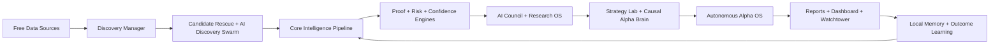

# Crypto Launch Intelligence

[](https://nodejs.org/)
[](LICENSE)
[](https://bilyeutaylor9-lang.github.io/Crypto-Launch-Intelligence/)
[](#engine-stack)
[](#ai-command-system)

## Autonomous AI Crypto Research Operating System

Crypto Launch Intelligence is an AI-powered crypto research desk built to discover early-stage market opportunities before they become obvious.

It scans free market, launch, social, GitHub, roadmap, liquidity, narrative, catalyst, wallet, and web research sources, then routes every project through a multi-agent intelligence pipeline.

This is not a simple token screener. It is a layered research system with:

- Free-source project discovery
- 10,000-candidate wide scan mode
- AI research agents
- Causal signal reasoning
- Self-evolving Alpha OS with thesis generation
- Paper-trade strategy simulation
- Outcome learning
- Watchtower alerts
- GitHub Pages dashboard publishing
- Persistent local memory
- Machine-readable institutional reports

> Research software only. This project does not provide financial advice, trading advice, or guaranteed predictions. Every output should be manually verified before any real-world decision.

## Quick Start

Run the full no-key demo:

```bash
npm install
npm run demo
open reports/report.html
```

Run a normal scan:

```bash
npm run scan
```

Run the wide free-source scan:

```bash
npm run scan:wide
```

Run the maximum Alpha OS scan:

```bash
npm run scan:op
```

Publish the local dashboard:

```bash
npm run publish:dashboard
open docs/index.html
```

Inspect the newest AI operating verdicts:

```bash
npm run ai-command-center
npm run strategy-lab
npm run causal-brain
npm run alpha-os
npm run alpha:os
npm run alpha:thesis
npm run alpha:contracts
npm run alpha:judge
npm run alpha:receipts
npm run alpha:governor
```

## What Makes It Different

Most scanners answer:

> What is pumping right now?

Crypto Launch Intelligence is designed to answer:

> What is quietly improving before the market fully notices?

The system does not trust one score. It builds a full research case:

- Discovery breadth: finds projects from many free sources instead of one API.
- Signal fusion: combines market, liquidity, narrative, catalyst, GitHub, social, roadmap, and risk data.
- Agent debate: multiple AI-style specialist agents argue the bull case, bear case, proof gaps, and invalidation rules.
- Causal reasoning: identifies which signal is actually driving the opportunity.
- Paper simulation: tracks strategy ideas before treating them as trusted.
- Outcome memory: compares old calls against later market behavior.
- Dashboard publishing: turns every scan into a public GitHub Pages intelligence dashboard.

## System Architecture



## AI Command System

The project now behaves like a miniature autonomous research organization.

| Layer | Purpose | Output |
| --- | --- | --- |
| AI Council | Debates narrative, flow, risk, research quality, and learning memory | `reports/ai-council.json` |
| Research OS | Creates lifecycle state, research tasks, scenarios, and red-team review | `reports/research-os.json` |
| AI Research Commander | Finds missing proof and assigns specialist agents | `reports/ai-research-commander.json` |
| Alpha Investigator | Builds alpha case files with bull case, bear case, gaps, and triggers | `reports/alpha-investigator.json` |
| Portfolio War Room | Ranks narratives, best-in-class candidates, and allocation buckets | `reports/portfolio-war-room.json` |
| Strategy Lab | Runs paper strategy tournaments and creates simulated trade plans | `reports/strategy-lab.json` |
| Causal Alpha Brain | Builds causal graphs, primary drivers, blockers, and counterfactuals | `reports/causal-alpha-brain.json` |
| Autonomous Alpha OS | Fuses strategy, causal, simulation, proof, risk, and commander agents | `reports/autonomous-alpha-os.json` |
| Paper Trading Lab | Grades Alpha OS calls against simulated outcome history | `reports/paper-trading-lab.json` |
| Weight Optimizer | Suggests engine-family weights from paper performance | `reports/weight-optimizer.json` |
| Breakout Brain | Runs thousands of quantum Monte Carlo paths and selects the top three best-available breakout candidates | `reports/breakout-brain.json` |
| High-Tech Alpha Stack | Adds ten command modules for consensus, contradictions, stress, manipulation, catalysts, rotation, fit, gaps, and readiness | `reports/high-tech-alpha-stack.json` |
| Self-Evolving Alpha OS | Builds identity graphs, world models, hypotheses, experiments, agent society debate, autopsy, regime adaptation, and thesis output | `reports/self-evolving-alpha-os.json` |
| Source Truth | Scores source reliability, provider health, and evidence agreement | `reports/source-truth.json` |
| GitHub Pro | Scores repository velocity, contributors, releases, and repo risk | `reports/github-intelligence-pro.json` |
| Alpha Evolution Governor | Fuses contracts, outcomes, sources, agents, discovery, risk, and memory into one operating queue | `reports/alpha-evolution-governor.json` |

## Autonomous Alpha OS

The Alpha OS is the final decision layer above the scanner.

It asks:

- Which strategy fits this project?
- What signal is really causing the score?
- What would happen if that driver disappeared?
- Is the setup supported by proof or just hype?
- Is risk blocking the thesis?
- Should the project be ignored, watched, paper-traded, or escalated?

Possible verdicts:

- `OS Strong Buy Research Candidate`
- `OS Best Available Candidate`
- `OS Priority Research`
- `OS Paper Trade`
- `OS Watch`
- `OS Risk Block`
- `OS Reject`

The system can still name a best available paper candidate when no project clears the true strong-buy gate. That helps avoid the scanner returning nothing while still keeping risk warnings visible.

## Self-Evolving Alpha OS

The highest-tier layer sits above Alpha OS and High-Tech Alpha Stack.

It builds:

- Project identity graph
- Market world model
- Testable alpha hypotheses
- Experiment lab for scoring changes
- Agent society debate
- Alpha autopsy risk review
- Market-regime adaptation
- Institutional thesis book

Key reports:

```bash
npm run alpha:os
npm run alpha:thesis
npm run alpha:debate
npm run alpha:autopsy
npm run alpha:regime
```

The master output is `reports/self-evolving-alpha-os.json`. The thesis book is `reports/alpha-theses.json`.

## Proof-Carrying Alpha Contracts

The newest accountability layer turns top ideas into falsifiable research contracts.

Instead of only saying a project looks strong, the system now writes:

- The thesis
- What must happen next
- What would invalidate the thesis
- Which engines supported it
- Which agents voted on it
- Which sources backed it
- Review windows at 1h, 24h, 7d, 30d, and 90d
- A public receipt that can be judged later

Key commands:

```bash
npm run alpha:contracts
npm run alpha:judge
npm run alpha:receipts
npm run contract-memory
```

The main report is `reports/alpha-contracts.json`. The leaderboard is `reports/alpha-contract-leaderboard.json`. Public receipts are written to `reports/alpha-contract-receipts.json`.

This makes the AI more accountable: future scans grade old contracts, mark invalidations, track win rate, and feed that reputation back into the next scan.

## Alpha Evolution Governor

The Alpha Evolution Governor is the new meta-control layer above the AI Council, Alpha OS, High-Tech Stack, and proof-carrying contracts.

It asks:

- Is the alpha contract strong enough?
- Did prior outcomes support the pattern?
- Are enough independent sources confirming the thesis?
- Do the specialist agents agree?
- Is discovery coverage broad enough?
- Is the research complete enough?
- Is risk low enough to keep investigating?
- What exact upgrade or proof task should happen next?

Key commands:

```bash
npm run alpha:governor
npm run alpha:queue
npm run evolution-memory
```

The main report is `reports/alpha-evolution-governor.json`. The operating queue is `reports/alpha-evolution-queue.json`.

Verdicts:

- `Governor Promote`
- `Governor Priority Research`
- `Governor Recheck Soon`
- `Governor Evidence Gap`
- `Governor Risk Block`

This gives the AI an operating brain that can say: promote, research deeper, recheck soon, block for risk, or fill missing proof.

## Outcome Lab and Auto-Learning

The next intelligence layer makes the AI accountable.

It tracks simulated Alpha OS calls and asks:

- Which strategies actually worked on paper?
- Which engines were useful and which were noise?
- Which source stacks were trustworthy?
- Which GitHub signals predicted real builder quality?
- Which risk warnings prevented bad calls?

The Paper Trading Outcome Lab records strategy calls, entry price, current price, estimated return, win/loss state, and strategy history.

The Auto-Learning Weight Optimizer converts that memory into engine-family weight suggestions for:

- Strategy Lab
- Causal Brain
- Simulation Brain
- Proof and source truth
- Risk Governor
- GitHub Pro

The system can then say things like:

```text
This setup uses a strategy with a 63% paper win rate.
AI Council is positive, but the Weight Optimizer says this pattern still needs more outcome samples.
Source Truth confirms the project across 4 source groups.
```

## Engine Stack

The latest engine audit loads **100+ engines** successfully.

Core engine families:

- Discovery engines
- Free market data engines
- Narrative and launch engines
- Roadmap and catalyst engines
- GitHub and developer engines
- GitHub Intelligence Pro engines
- Source Truth and provider reliability engines
- Social and X intelligence engines
- Liquidity and capital-flow engines
- Whale and smart-wallet engines
- Risk, trap, sell-pressure, unlock, and vesting engines
- Proof, confidence, and explainability engines
- Pre-pump pattern engines
- Quantum outcome engines
- Simulation and outcome-learning engines
- Paper-trading outcome and weight-optimization engines
- AI council, dossier, commander, investigator, strategy, causal, and Alpha OS engines

Run the audit:

```bash
npm run engine:audit
```

## Free-Source Discovery Mesh

The scanner is designed to keep working even when some providers rate-limit, block, or fail.

Supported discovery and research sources include:

- DexScreener
- GeckoTerminal
- CoinGecko
- CoinPaprika
- DeFiLlama
- CoinCap
- CoinLore
- CryptoCompare
- Binance, KuCoin, Coinbase, Kraken, OKX, Bybit, Gate.io, MEXC, Bitget, HTX, Bitfinex, Bitstamp, Gemini
- DexScreener latest token profiles
- DexScreener token boosts
- GitHub project discovery
- Google News RSS search
- Crypto RSS feeds
- Project websites
- Same-domain free web crawler
- Built-in research seed fallback
- Candidate rescue expansion

Wide scan mode targets up to 10,000 free-source candidates:

```bash
npm run scan:wide
```

If free APIs fail, the Adaptive Source Router records the problem and routes future scans around weak providers:

```bash
npm run source-router
```

## Intelligence Flow

Each project moves through a layered pipeline:

1. Discovery and deduplication
2. Market and liquidity normalization
3. Narrative, launch, roadmap, and catalyst analysis
4. GitHub, developer, community, and social analysis
5. Wallet, whale, smart-money, and capital-flow analysis
6. Risk, trap, sell-pressure, tokenomics, vesting, and unlock analysis
7. Proof, confidence, source reliability, and explainability scoring
8. AI Council debate and Research OS lifecycle routing
9. Simulation Brain, Quantum Brain, Market Scientist, and Outcome Judge
10. Dossier Swarm, Commander, Investigator, and Portfolio War Room
11. Strategy Lab, Causal Alpha Brain, and Autonomous Alpha OS
12. Watchtower alerts, reports, dashboard publishing, and memory updates

## Self-Learning Memory

The system saves local memory under `data/` so future scans can compare projects against previous behavior.

Memory files include:

- `data/scan-history.json`
- `data/project-watchlist.json`
- `data/outcome-snapshots.json`
- `data/outcome-calibration.json`
- `data/pre-pump-patterns.json`
- `data/internet-research-memory.json`
- `data/agent-performance-memory.json`
- `data/strategy-memory.json`
- `data/paper-trading-outcomes.json`
- `data/alpha-contracts.json`
- `data/alpha-evolution-governor-memory.json`
- `data/source-router-memory.json`
- `data/watchtower-alerts.json`
- `data/watchtower-brief.json`

These files are runtime memory and usually should not be committed.

## Reports Generated

Every scan can generate a full research packet:

| Report | Description |
| --- | --- |
| `reports/report.html` | Main dashboard |
| `reports/report.json` | Full machine-readable scan output |
| `reports/opportunities.csv` | Spreadsheet-friendly opportunity export |
| `reports/summary.txt` | Text summary |
| `reports/ai-council.json` | AI Council debate and verdicts |
| `reports/research-os.json` | Lifecycle, scenarios, red-team review, and research tasks |
| `reports/ai-command-center.json` | Unified AI research desk report |
| `reports/strategy-lab.json` | Strategy tournament and paper plans |
| `reports/causal-alpha-brain.json` | Causal graph and counterfactual analysis |
| `reports/autonomous-alpha-os.json` | Final AI operating verdict |
| `reports/alpha-dashboard-v2.json` | Unified Alpha OS, paper, source, GitHub, and weight dashboard |
| `reports/paper-trading-lab.json` | Simulated strategy outcome tracking |
| `reports/weight-optimizer.json` | Auto-learning engine-family weight suggestions |
| `reports/breakout-brain.json` | Top-three breakout research picks from thousands of simulations |
| `reports/high-tech-alpha-stack.json` | Ten-module institutional command stack |
| `reports/self-evolving-alpha-os.json` | Master self-evolving research OS |
| `reports/alpha-theses.json` | Institutional thesis book for top candidates |
| `reports/alpha-contracts.json` | Falsifiable alpha contracts with proof, invalidation rules, and memory |
| `reports/alpha-contract-leaderboard.json` | Contract rankings, engine leaderboard, agent leaderboard, and autopsy queue |
| `reports/alpha-contract-receipts.json` | Public accountability receipts for top contracts |
| `reports/alpha-evolution-governor.json` | Meta-governor operating report |
| `reports/alpha-evolution-queue.json` | Promote, priority research, recheck, evidence-gap, and risk-block queues |
| `reports/source-truth.json` | Provider trust and source agreement |
| `reports/github-intelligence-pro.json` | Repository quality and builder signal report |
| `reports/simulation-brain.json` | Market-memory analogs and scenario simulation |
| `reports/outcome-judge.json` | Reality grading and outcome accountability |
| `reports/catalyst-radar.json` | Time-sensitive why-now events |
| `reports/dossier-swarm.json` | Specialist project research packets |
| `reports/portfolio-war-room.json` | Narrative battle map and allocation buckets |
| `reports/source-router.json` | Free-source provider health |
| `reports/engine-audit.json` | Engine import and readiness audit |
| `reports/roadmap.json` | Public roadmap data |

The `examples/` directory contains demo-generated output so visitors can inspect the system without running APIs.

## Live Dashboard

This repository can publish a public dashboard through GitHub Pages:

[Live dashboard](https://bilyeutaylor9-lang.github.io/Crypto-Launch-Intelligence/)

Local dashboard:

```bash
npm run demo
npm run publish:dashboard
open docs/index.html
```

GitHub setup:

1. Open the repository on GitHub.
2. Go to `Settings` -> `Pages`.
3. Set source to `GitHub Actions`.
4. Run the dashboard workflow from the `Actions` tab.

## Command Center

Common commands:

```bash
npm run demo
npm run scan
npm run scan:wide
npm run scan:op
npm run dashboard
npm run publish:dashboard
npm run engine:audit
```

AI reports:

```bash
npm run ai-council
npm run research-os
npm run ai-command-center
npm run research-commander
npm run alpha-investigator
npm run portfolio-war-room
npm run strategy-lab
npm run causal-brain
npm run alpha-os
npm run alpha-dashboard-v2
npm run paper-lab
npm run weight-optimizer
npm run breakouts
npm run high-tech
npm run alpha:os
npm run alpha:thesis
npm run alpha:contracts
npm run alpha:judge
npm run alpha:receipts
npm run alpha:governor
npm run alpha:queue
npm run source-truth
npm run github-pro
```

Learning and memory:

```bash
npm run patterns
npm run backtest
npm run agent-memory
npm run strategy-memory
npm run paper-memory
npm run contract-memory
npm run evolution-memory
npm run source-router
```

Watchtower:

```bash
npm run watchtower
npm run watchtower:daemon
npm run alerts
npm run brief
```

CLI shortcuts:

```bash
node src/cli.js demo
node src/cli.js scan
node src/cli.js wide
node src/cli.js alpha-os
node src/cli.js explain AKT
```

## Optional API Keys

The scanner works without paid keys, but optional keys can improve coverage:

```bash
export BIRDEYE_API_KEY="your_birdeye_key"
export X_BEARER_TOKEN="your_x_bearer_token"
export CRYPTOPANIC_API_KEY="your_cryptopanic_key"
```

GitHub repository secrets can use the same names.

## Example Output

Inspect demo artifacts:

```bash
open examples/report.html
cat examples/ai-command-center.json
cat examples/strategy-lab.json
cat examples/causal-alpha-brain.json
cat examples/autonomous-alpha-os.json
cat examples/alpha-dashboard-v2.json
cat examples/paper-trading-lab.json
cat examples/weight-optimizer.json
cat examples/breakout-brain.json
cat examples/high-tech-alpha-stack.json
cat examples/alpha-contracts.json
cat examples/alpha-contract-leaderboard.json
cat examples/alpha-evolution-governor.json
cat examples/alpha-evolution-queue.json
cat examples/source-truth.json
cat examples/github-intelligence-pro.json
cat examples/portfolio-war-room.json
cat examples/source-router.json
```

Example Alpha OS fields:

```json
{
  "verdict": "OS Best Available Candidate",
  "mode": "Best Available Paper Candidate",
  "primaryDriver": "Evidence Quality",
  "bestStrategy": "Truth-Verified Alpha",
  "nextActions": [
    "Verify the primary causal driver against raw evidence before any live decision.",
    "Run paper-trade tracking through the expected holding window."
  ]
}
```

## Project Structure

```txt
src/
  data/        free-source discovery and web research connectors
  engines/     scoring, AI, simulation, risk, causal, and strategy engines
  learning/    local memory and outcome tracking
  reports/     JSON, CSV, HTML, dashboard, and GitHub Pages publishers
  index.js     main scanner entry point
  cli.js       command-line interface
test/          engine tests
examples/      committed demo outputs
docs/          generated GitHub Pages dashboard
```

## Development

Run tests:

```bash
npm test
```

Run demo and refresh examples:

```bash
npm run demo
```

Audit all engines:

```bash
npm run engine:audit
```

## Roadmap

Next major upgrades:

- Larger free-source discovery expansion
- Better historical pre-pump and rug-pattern labeling
- Paper-trade outcome tracking per strategy
- More GitHub repository intelligence
- More robust source reliability scoring
- Live dashboard filtering and candidate drilldowns
- Engine weight optimization from real outcomes
- Autonomous Watchtower scheduling with richer alert routing

## License

MIT. See [LICENSE](LICENSE).

## Disclaimer

Crypto Launch Intelligence is experimental research software. It can be wrong, incomplete, delayed, or misled by bad data. Crypto markets are high risk. Do your own research and never treat scanner output as financial advice.
