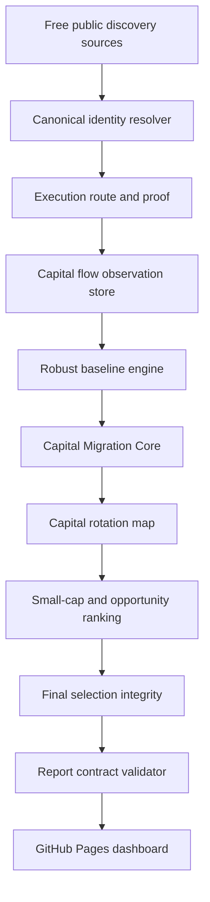

# Mathematical Methodology

Crypto Launch Intelligence treats every market score as a research signal, not financial advice. A project can only move toward a qualified research lead when identity, chain, contract, route, liquidity, safety, catalyst, and independent evidence are present. Missing values stay missing. They are not converted into zero risk, perfect safety, or synthetic upside.

## Production Data Flow



## Numeric Safety

All math helpers live in `src/math`. They reject non-finite values and return `null` when an input is missing or a denominator is invalid.

- `numberOrNull(x)` returns a finite number or `null`.
- `safeDivide(a, b)` returns `null` unless both values are finite and `b` is non-zero.
- `percentRatio(a, b)` returns `(a / b) * 100` or `null`.
- `clamp(x, min, max)` clamps finite values only.

## Returns And Drawdown

Forward return:

```text
forwardReturnPct = ((futurePriceUsd - entryPriceUsd) / entryPriceUsd) * 100
```

Log return:

```text
logReturn = ln(currentPriceUsd / previousPriceUsd)
```

Maximum drawdown:

```text
drawdown_t = price_t / runningPeak_t - 1
maximumDrawdownPct = min(drawdown_t) * 100
```

If either price is missing or non-positive, the metric is `null`.

## Robust Baselines

The baseline engine builds rolling 5m, 15m, 1h, 4h, 24h, and 7d windows from persisted capital-flow observations. It uses median, median absolute deviation, winsorized means, and EWMA to reduce outlier damage.

Robust z-score:

```text
robustZ = 0.6745 * (x - median(values)) / MAD(values)
```

EWMA:

```text
ewma_t = alpha * x_t + (1 - alpha) * ewma_(t-1)
```

## Capital Migration Core

Capital Migration Core is designed to detect real money moving into smaller projects before social attention fully catches up. It uses relative flow, not only absolute dollars.

Formula:

```text
capitalMigrationScore =
  0.25 * relativeNetFlow +
  0.20 * flowAcceleration +
  0.20 * buyerBreadth +
  0.15 * liquidityExpansion +
  0.10 * flowPersistence +
  0.10 * priceFlowAttentionGap
```

Missing components are excluded from the available-weight numerator, then penalized through evidence coverage:

```text
availableScore = weightedAvailableComponents / availableComponentWeight
coveragePenalty = missingComponentShare * 45
finalScore = availableScore * (1 - coveragePenalty / 100)
```

Core lanes:

- `CONFIRMED_EARLY_FLOW`: verified route, executable liquidity, safety pass, and strong capital migration evidence.
- `EARLY_FLOW_RESEARCH`: capital movement exists, but one or more required execution or evidence items are incomplete.
- `FLOW_ACCELERATING`: buyer or net-flow acceleration is visible but not yet fully confirmed.
- `TWO_X_ASYMMETRIC_WATCH`: smaller-cap flow profile worth research, not a forced pick.
- `LATE_CHASE`: price has already outrun flow.
- `CAPITAL_OUTFLOW`: net flow is negative or liquidity is leaving.
- `UNSAFE_OR_MANIPULATED`: blocked by safety, concentration, honeypot, or route failure.
- `INSUFFICIENT_DATA`: not enough validated evidence.

## Correlation Control

Internal engines can agree with each other, but they are not independent external evidence. Correlated signal families are collapsed with an effective signal count:

```text
effectiveSignals = n / (1 + averageAbsoluteCorrelation * (n - 1))
```

This prevents narrative, momentum, and AI summaries from being counted repeatedly as separate proof.

## Calibration And Outcomes

The exact outcome lab evaluates predictions only against observations recorded after the prediction timestamp. Supported horizons are 1h, 6h, 24h, 3d, 7d, 30d, and 90d.

Each horizon records:

- forward return
- maximum favorable excursion
- maximum adverse excursion
- maximum drawdown
- liquidity survival
- route survival
- rug, honeypot, pool disappearance, and delisting events when evidence exists

Probability-style outputs remain `PRELIMINARY` or `INSUFFICIENT_SAMPLE` until enough out-of-sample outcomes exist.

## Reporting Contract

The report validator fails when required reports are missing, malformed, empty, or contain non-finite values. It also rejects literal `N/A` placeholders so the dashboard uses explicit states such as `NO QUALIFIED CANDIDATE`, `NO VERIFIED ROUTE`, `INSUFFICIENT INPUT DATA`, or `REPORT NOT GENERATED`.
